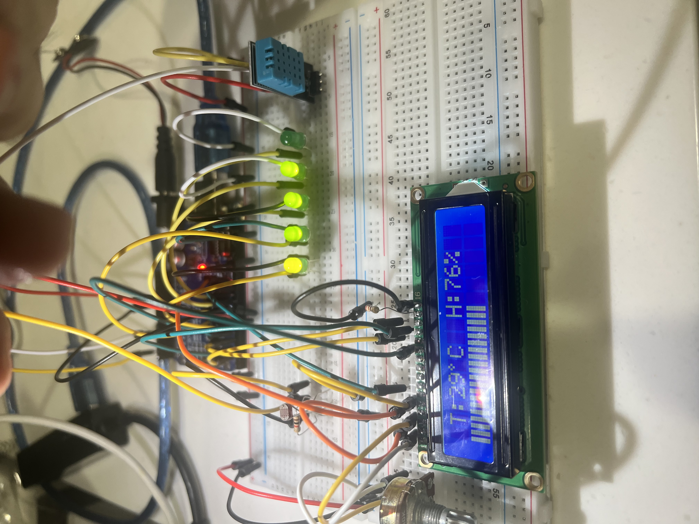

# MLDAxEEE-SLOPPYBCODERS
Project for Rashie's Hackathon.

## About

This is a mini-project for MLDAxEEE Hackathon conducted on Oct-2022 from Nanyang Technological University.
This project has a hardware component that is primarily focused on gathering environmental data which is run
with our Machine learning models to predict Solar energy output and total energy required.

## Rationale
 
A vital fight any smart nation has to battle is the effective use of renewable energy while reducing tranditional
methods of energy production. Some of the largest costs in the energy industry rise from ineffective usage of storage and overproduction of power.
With our project, we can predict the required required enegy, essentially solving several issues. This also allows for the automisation
of energy production to a larger degree than today.
 

## Our Hardware prototype : 

 

## 🧠 The Team

| Name                   |GitHub Acount|
|---|---|
| Minze |@min-ze|
| David Tey |@davidtey|
| Preetish |@preetish246|
| Wee Hung |@axwhyzee|
| Khoo Yong Hui |@Beelzebulb|
| Harish |@JULU909| -->
 

## 📖 References

### Datasets

SOLAR POWER  
———————  
[Data]   https://www.kaggle.com/datasets/saurabhshahane/northern-hemisphere-horizontal-photovoltaic  
[Research]  https://www.researchgate.net/publication/341511536_Machine_Learning_Modeling_of_Horizontal_Photovoltaics_Using_Weather_and_Location_Data  

ENERGY DEMAND  
————————-  
[Data]   
https://www.kaggle.com/competitions/ashrae-energy-prediction/data  

## Our Machine Learning models : 

 
This is the software side of our project. We used MPLRegressor to predict Solar power generated based on the environmental data gathered . We have a secondary model using DecisionTreeRegressor to predict energy requried for a specific population. This allows us to dynamically change the amount of fossil fuels and other traditional methods' usage. We use real time data and feed it to the first model to get the amount of energy we need to compensate for.
 

## Seeingisbelieving :
 
 
 

