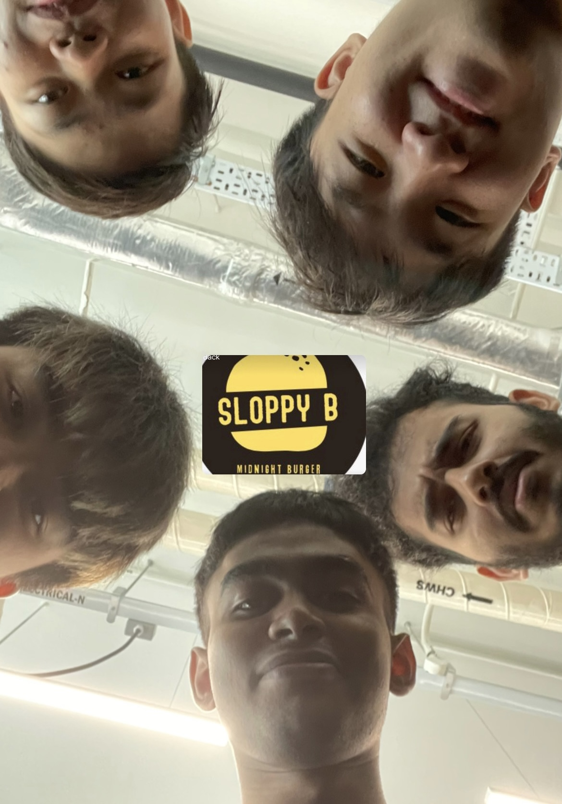

# MLDAxEEE-SLOPPYBCODERS
Code for our machine learning algorithm in rashie's hackathon

Project for Rashie's Hackathon

<!-- ## 🧠 The Team
| Name              |                     Position                    |GitHub Acount|
|---|:---:|---|
| Minze |        Member      |@|
| David Tey  |    Member     |@|
| Preetish |       Member        |@|
| WeeHUNG |       Member       |@|
| Yonghui |           member|@|
| Harish |       Member        |@| -->

## 📖 References

### Datasets

### Description
